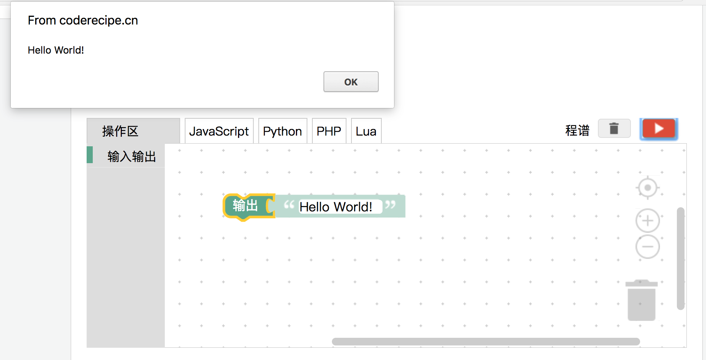
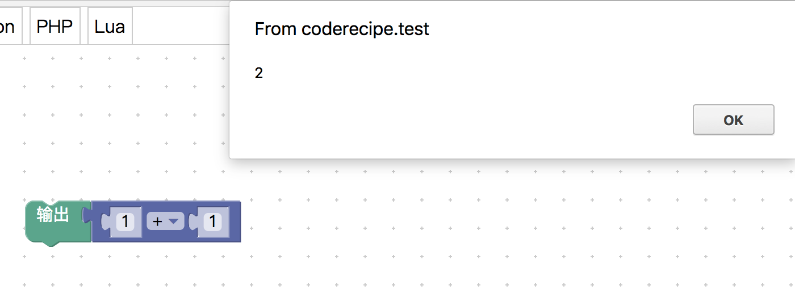
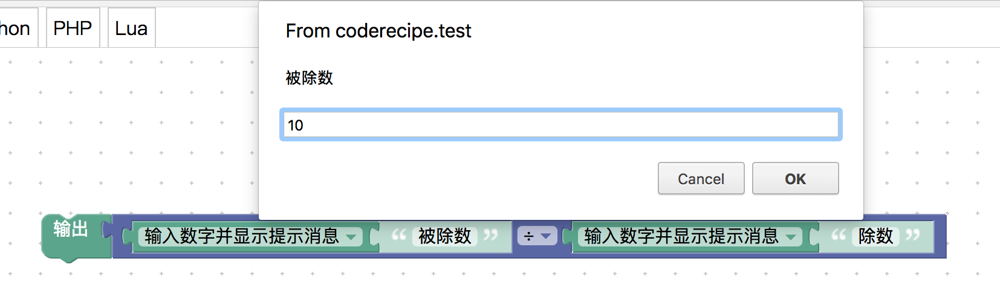

<notice>教程读者请不要直接阅读本文件，因为诸多功能在此无法正常使用，请移步至[程谱 coderecipe.cn](https://coderecipe.cn/learn/1)学习完整教程。如果您喜欢我们的教程，请在右上角给我们一个“Star”，谢谢您的支持！</notice>
Java教程-
======

欢迎来到程谱社区！😁 我们是一群留学生，致力于搭建一个系统而又不枯燥的零基础入门编程学习平台。希望大家能多多支持我们，如果发现我们的不足之处也欢迎联系我们~

这是程谱Java数组与数组列表教程的第1章，主要为大家讲解数组（Array）。请大家进行学习！

数组的定义和数组值的存取
------
我们今天来讲一个Java语言中全新的对象：数组（Array）。

数组就是一个对象，将相同类型的一列类型数据放在这一个对象之中。大家不要被“数组”这个名字蒙蔽，这些数据不一定得是数字，而可以是任何类型的数据。比如说，我们可以把bus,trunk,car等数据全部放进一个叫做vehicle的数组中。

接下来，我们来看一看在Java语言中，如何定义一个数组：

e.g.
```java
double[] data;
```

或

```java
double data[];
```
这两行代码的意义是一样的，意味着我们定义了一个名字叫做data的数组，这个数组的类型为double型（也就是说存储在其中的数据都是double型的）。

在定义了数组之后，我们可以对其初始化，比如说，定义它的长度是15。定义数组长度的代码如下：

e.g.
```java
data = new double[15];
```
当然了，我们也可以在定义数组的同时就赋予它初始化的长度：
```java
double[] data = new double[15];
```
除了在初始化数组时定义它的长度，我们甚至可以在定义和初始化的时候直接往数组里面填数值：

e.g.
```java
int[] data = {1,2,3};
```
如果在初始化时直接往数组里填入了数值，那么这个时候数组的长度就会被自动识别（例如上例中，数组data的长度就已经默认为3），就不需要再写。这种初始化方法叫initializer list。

要是想访问数组内的某个元素（想得知在数组内某个位置的数值），可以使用以下代码（index是从0~数组内元素的数量-1的整数）：
```java
Element1 = arrayName[index];
```
如果想要写入或更改数组的某个元素也可以使用同理的方法：
```java
arrayName[index] = Element1;
```
需要注意的是，index超出范围会出现异常，抛出ArrayIndexOutOfBoundsException。

数组的长度
------
数组的长度是固定的，想要获取数组长度，可以使用以下代码：
```java
arrayName.length
```
TIPS：数组的长度不用()，字符串的长度要加()

e.g.
```java
//String
String str = “CodeRecipe”;
System.out.println(str.length());
//Array
int[] arr = {1,2,3,4,5};
System.out.println(arr.length);
```
说了那么多关于数组的知识和如何使用它的方法，我们来看一个实例来了解它的真正用处吧：

e.g.
```java
int array[] = {1,2,3};
	  for(int i = 0;i < 3;i ++)
        System.out.println("Hello "+array[i]);
```
以上代码运行后输出：
```java
Hello 1
Hello 2
Hello 3
```
为了让大家理解的更清楚一些，我们在这里再举几个更加实际的例子来说明数组究竟有多大的用处。

e.g.

比如说，根据大家在要表示10个学生的身高，我们可以这么做：
```java
double student1Weight = xxx;
double student2Weight = xxx;
…
double student10Weight = xxx;
```
然而，如果有100个学生这个代码就要长到100行了。
使用数组就可以极大地减轻我们的工作量。我们只需要以下一行代码：
```java
double studentWeight[] = {xxx,xxx,….,xxx};
```
当然，如果你认为数组完全可以用多个变量代替，那么你就会发现下面的事情不用数组很难做到：
```java
double studentWeight[] = {xxx,xxx,….,xxx};
for(int i = 0; i < 100;i++){
System.out.println(stndentWeight[i]);
}
```
数组的长度
------
通过我们之前学过的循环方法，我们可以遍历整个数组中的元素：

1.for循环遍历

e.g.
```
for(int i = 0;i<array.length;i++){
//对array[i]操作
}
```
2.for-each循环遍历

e.g.
```
int array[] = {1,2,3};
	    for( int i : array){
	        System.out.println(i);
	    }
```
这样就会把数组中的内容都输出出来。

TIPS:在for-each循环中不能增加或者减少数组的内容，不然可能会导致循环出现问题。
作为参数传递数组
----
Array被当做一种对象Object，他在被传递的时候传递的是Reference而不是值（具体后面会提到），所以Java不会把Array复制一份。传入后修改array的内容会导致原array变量读取出的是修改后的内容。比如下面这个例子：

e.g.
```
//我们这里有一个函数
public static void changeArray(int[] b){
for(int i = 0;i < b.length;i++)
b[i]+=3;
}
//在主函数里
int[] array = {1,2,3,4};
changeArray(array);
System.out.print(“The changed array is”);
for(int n:list) System.out.print(n+” ”);
//System.out.print也是输出用的函数，只是不换行
```
结果会输出
```
The change array is 4,5,6,7
```
小练习
------


练习环境小热身
------
下面是练习框，让我们跟着练习框的下方的指示一起来熟悉一下练习环境吧。

<lab lang="blocks" parameters="logic=false&math=false&loops=false&lists=false&color=false&variables=false&functions=false&text=false&name=chapter1lab1">
  <notice>练习环境在此无法显示，请移步至[程谱 coderecipe.cn](https://coderecipe.cn/learn/1)查看。</notice>
</lab>

首先，点击左边的“输入输出”，将“输出”块拖到右边。然后，修改一下文字“abc”成“Hello World!”，再点击右边的红色按钮运行。
结果应该是这样：


那输入呢？ 让我们把“输入文字并提示消息”块插到“输出”块上，这里的提示消息指的是在输入文字的时候会告诉我们程序的使用者输入的文字的含义，同样点击运行，首先输入一些文字，然后点确认，这串文字就会被输出了。当然，我们也可以通过下拉框选择让这个输入块读取数字，试一试吧。

如果想删除一个块，把它拖到右下角的垃圾桶图标上就好了。


细心的你可能会发现，在选择输入数字以后，如果输入的不是一个数字，就会输出NaN，这是为什么呢？其实NaN的意思是Not a Number，代表程序告诉我们输入的并不是一个数字。

这样，我们就做出了一个小程序，它能读取用户的输入，然后对数字进行处理，然后输出回来，是不是很有意思呀~

计算
------
刚才我们学完了最基本的输入输出，那接下来我们可以更进一步，学一下如何让计算机来为我们进行运算。

<lab lang="blocks" parameters="logic=false&loops=false&lists=false&color=false&variables=false&functions=false&text=false&name=chapter1lab2">
  <notice>练习环境在此无法显示，请移步至[程谱 coderecipe.cn](https://coderecipe.cn/learn/1)查看。</notice>
</lab>

你可能会发现，这个练习环境和之前不一样，因为这里多了一个“数学”按钮，点进去以后会发现里面全都是数学运算，看起来好复杂的样子。让我们从简单的开始，先拖动一个“1+1”块（其实这是四则运算加乘方块，我们等一会儿就知道啦），插在“输出”块上，点击运行，大功告成啦！


这个“1+1”块可没有看起来那么简单，这个块是可是可以高度定制的呢！我们可以1+1成为任意的四则运算内容，比如10÷5。而且这个“1+1”块内部还可以嵌入其他块，这样就可以做好多次加减乘除啦。

我们还可以把输入块放入这个运算块里，不过记得选择“输入数字并显示消息”而不是“输入文字并显示消息”，不然是放不进运算块的，毕竟文字可不能进行四则运算。

像底下这样组合块就可以做出一个除法计算器啦！


小练习
------
1.Which of the following correctly initializes an array arr to contain four elements each with value 0?

I int[] arr = {0, 0, 0, 0};

II int[] arr = new int[4];

III int[] arr = new int[4];

  for (int i = 0; i < arr.length; i++)
arr[i] = 0;

(A) Ionly

(B) IIIonly

(C) IandIIIonly

(D) IIandIIIonly

(E) I,II,andIII

下面的内容要按一下才会显示：
<cr type="hidden"><notice>隐藏内容功能在此无法正常显示，请移步至[程谱 coderecipe.cn](https://coderecipe.cn/learn/1)查看。</notice>E</cr>

2.Refer to the following codes egment. You may assume that arr is an array of int values.
```java
int sum = arr[0], i = 0; while (i < arr.length) {
i++;
sum += arr[i]; }
```
Which of the following will be the result of executing the segment?

(A) Sumofarr[0],arr[1],...,arr[arr.length-1]willbestoredinsum.

(B) Sumofarr[1],arr[2],...,arr[arr.length-1]willbestoredinsum.

(C) Sumofarr[0],arr[1],...,arr[arr.length]willbestoredinsum.

(D) Aninfiniteloopwilloccur.

(E) A run-time error will occur.

下面的内容要按一下才会显示：
<cr type="hidden"><notice>隐藏内容功能在此无法正常显示，请移步至[程谱 coderecipe.cn](https://coderecipe.cn/learn/1)查看。</notice>E</cr>
学到这里，你就已经算是入门计算机编程啦👏，加油加油继续学习吧~
