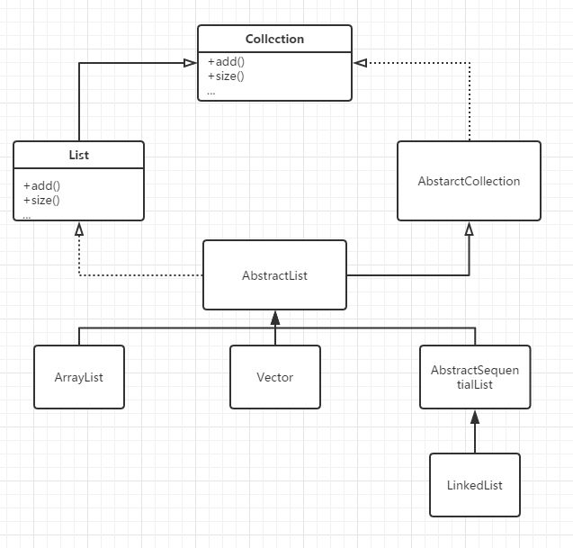

<notice>教程读者请不要直接阅读本文件，因为诸多功能在此无法正常使用，请移步至[程谱 coderecipe.cn](https://coderecipe.cn/learn/4)学习完整教程。如果您喜欢我们的教程，请在右上角给我们一个“Star”，谢谢您的支持！</notice>
List&lt;E>接口
======

欢迎来到程谱社区！😁 我们是一群留学生，致力于搭建一个系统而又不枯燥的零基础入门编程学习平台。希望大家能多多支持我们，如果发现我们的不足之处也欢迎联系我们~

这是程谱Java教程数组与数组列表单元的的第3章，主要为大家讲解List接口。请大家进行学习！

List&lt;E>的结构
-----
List是一个有序的集合，和set不同的是，List允许存储项的值为空，也允许存储相等值的存储项。List主要分为3类，ArrayList， LinkedList和Vector。

为了进一步清晰List的结构，大家可以看一下下图。它其实是继承于Collection接口，除了Collection通用的方法以外，扩展了部分只属于List的方法。


ArrayList&lt;E>类
-----
ArrayList<E>实现了List<E>接口（可以当成一种List&lt;E>），就是一列类型为E的元素，并允许重复。
List&lt;E>可以让你：
1.使用整数index来访问任何位置的元素

2.在list中的任何地方插入元素

3.遍历所有元素

那么，我们就来看一下，如何使用List&lt;E>的一些方法。

如何使用List&lt;E>
-----
1.
```java
boolean add(E obj);
//在list的末尾添加obj，总是返回true，如果元素不是E类型的，抛出ClassCastException
```
2.
```java
int size();
//返回list中的元素数量
```
3.
```java
E get(int index);
//返回在index的元素
```
4.
```java
E set(int index, E element);
//把在index位置的元素换成element，返回原先在index的元素，如果特定元素不是E类型的，会抛出ClassCastException
```
5.
```java
void add(int index,E element);
//在index处加入element，把index处及其之后的元素都会向后移动1个位置。List的大小增加1。
```
6.
```java
E remove(int index)
//删除在index位置的元素，返回原来index位置的元素。在index位置后的元素会向前移动1个位置。List的大小减一。
```
TIPS:如果index<0||index>=size()，那么此时操作会抛出IndexOutOfBoundException。add操作除外，对它来说在末尾添加元素是可以的，此时如果index<0||index>size()会抛出exception。

讲完了List&lt;E>的方法，我们再来讲讲主角ArrayList&lt;E>的方法：

如果我们想创建一个空list，我们可以使用以下方法：
```java
ArrayList<E> name = new ArrayList<E>();
```
TIPS: 在末尾对ArrayList进行操作很有效率，因为它的长度是可变的。如果在中部操作ArrayList会造成操作元素后的元素移位。

小练习
-----
1.Consider the following code segment,applied to list,an ArrayList of Integer values.
```java
int len = list.size();
for (int i = 0; i < len; i++) {
  list.add(i + 1, new Integer(i));
  Object x = list.set(i, new Integer(i + 2));
}
```
If list is initially 6 1 8, what will it be following execution of the code segment?
(A) 2 3 4 2 1 8

(B) 2 3 4 6 2 2 0 1 8

(C) 2 3 4 0 1 2

(D) 2 3 4 6 1 8

(E) 2 3 3 2

下面的内容要按一下才会显示：
<cr type="hidden"><notice>隐藏内容功能在此无法正常显示，请移步至[程谱 coderecipe.cn](https://coderecipe.cn/learn/4)查看。</notice>A</cr>
2.Here is the getTotal method from the Purse class:
```java
/** @return the total value of coins in purse */ public double getTotal()
{
double total = 0; /* more code */ return total;
}
```
Which of the following is a correct replacement for more code?

(A)
```java
for (Coin c : coins){
  c = coins.get(i);
  total += c.getValue();
}
```
(B)
```java
for (Coin c : coins){
  Coin value = c.getValue();
  total += value;
}
```
(C)
```java
for (Coin c : coins){
  Coin c = coins.get(i);
  total += c.getValue();
}
```
(D)
```java
for (Coin c : coins){
  total += coins.getValue();
}
```
(E)
```java
for (Coin c : coins){
  total += c.getValue();
}
```

下面的内容要按一下才会显示：
<cr type="hidden"><notice>隐藏内容功能在此无法正常显示，请移步至[程谱 coderecipe.cn](https://coderecipe.cn/learn/4)查看。</notice>E</cr>
